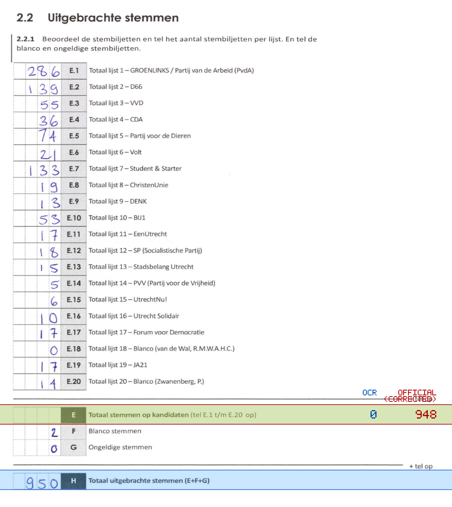
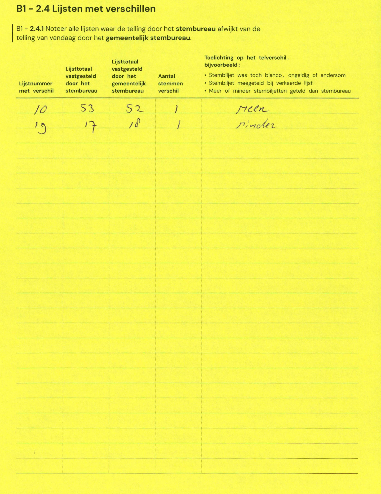

# Station 96 - Burg Fockema Andreaelaan 9

- Status: `internally inconsistent`
- Markdown: `2026-GR/0344/results/Utrecht_96_Gymzaal_Burg_Fockema_Andreaelaan_GR26_eerste_telling.md`
- Correction OCR: `2026-GR/0344/results/corrections/Utrecht_96_Gymzaal_Burg_Fockema_Andreaelaan_GR26.md`

## Details

- E.1 through E.20 sum to 948, but E is 0
- E + F + G is 2, but H is 950
- E: md=0, official=948

## Candidate Votes

- Status: `incomplete`
- Compared candidate cells: 0/508
- Candidate OCR files: 0
- candidate OCR not available
- known list/correction issues are shown

Legend: yellow/red = official CSV mismatch; blue = internal consistency issue. The right margin shows OCR and official values for official mismatches.



## Corrections

```markdown
| ID | First | Second | Difference | Note |
|---|---:|---:|---:|---|
| E.10 | 53 | 52 | -1 | meer |
| E.19 | 17 | 18 | 1 | minder |
```


