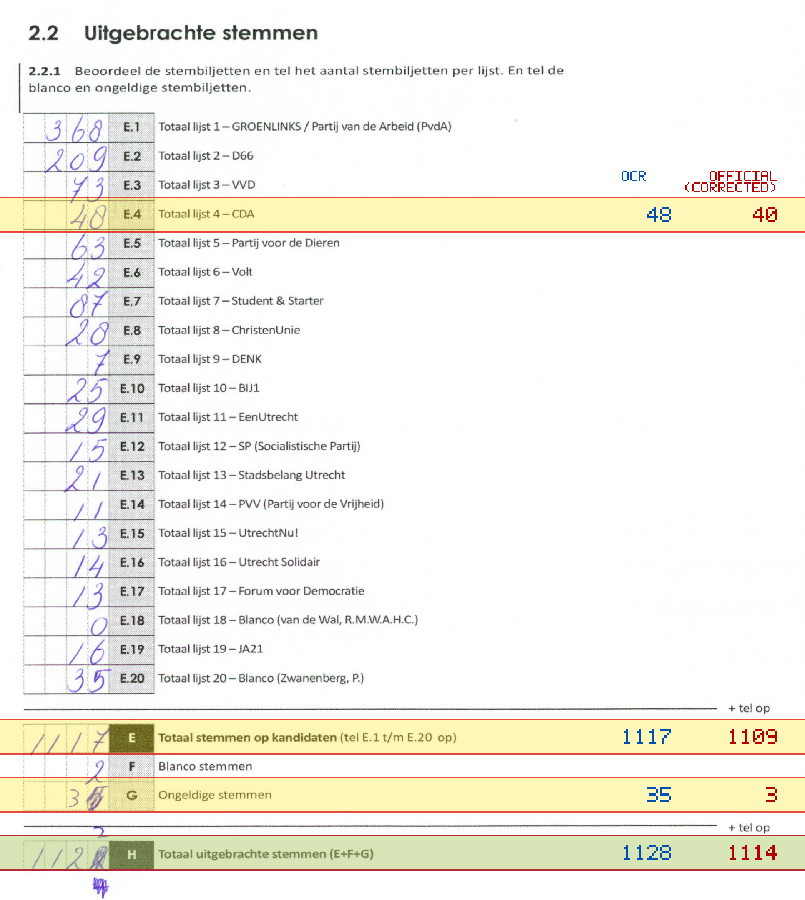
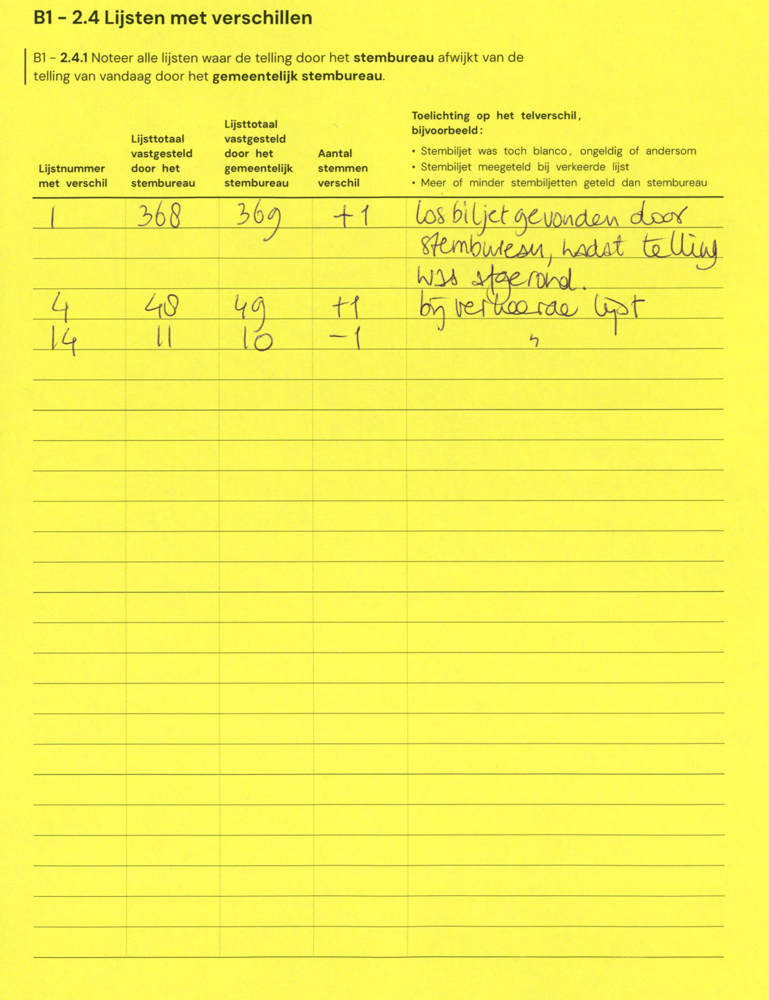

# Station 98 - Marislaan 1

- Status: `internally inconsistent`
- Markdown: `2026-GR/0344/results/Utrecht_98_Prof_Kohnstammschool_GR26_eerste_telling.md`
- Correction OCR: `2026-GR/0344/results/corrections/Utrecht_98_Prof_Kohnstammschool_GR26.md`

## Details

- E + F + G is 1154, but H is 1128
- E.4: md=48, official=40
- E: md=1117, official=1109
- G: md=35, official=3
- H: md=1128, official=1114

## Candidate Votes

- Status: `incomplete`
- Compared candidate cells: 0/508
- Candidate OCR files: 0
- candidate OCR not available
- known list/correction issues are shown

Legend: yellow/red = official CSV mismatch; blue = internal consistency issue. The right margin shows OCR and official values for official mismatches.



## Corrections

```markdown
| ID | First | Second | Difference | Note |
|---|---:|---:|---:|---|
| E.1 | 368 | 369 | 1 | los biljet gevonden door stembureau, nadat telling was spaarond |
| E.4 | 40 | 49 | 9 | bij verkeerde lijst |
| E.14 | 11 | 10 | -1 | |
```


